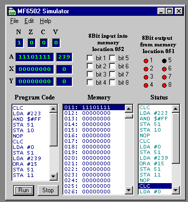



## Micro 6502 Simulator

### Description

This code simulates a 6502 processor. you can program in assembly language and test your ideas without the actual chip.
 
### More Info
 

             |
---                |---
**Submitted On**   |2001-04-24 16:18:24
**By**             |[Mike Firoved](https://github.com/Planet-Source-Code/PSCIndex/blob/master/ByAuthor/mike-firoved.md)
**Level**          |Advanced
**User Rating**    |5.0 (35 globes from 7 users)
**Compatibility**  |VB 5\.0, VB 6\.0
**Category**       |[Complete Applications](https://github.com/Planet-Source-Code/PSCIndex/blob/master/ByCategory/complete-applications__1-27.md)
**World**          |[Visual Basic](https://github.com/Planet-Source-Code/PSCIndex/blob/master/ByWorld/visual-basic.md)
**Archive File**   |[Micro 6502187954242001\.zip](https://github.com/Planet-Source-Code/mike-firoved-micro-6502-simulator__1-22670/archive/master.zip)

### API Declarations

?

